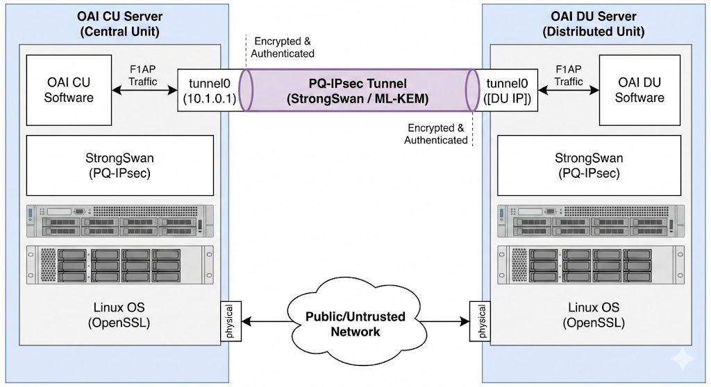

# OAI-F1AP-PQ-IPSec

This repository contains instructions and configuration files for establishing a Post-Quantum (PQ) secure IPsec tunnel using StrongSwan between an OpenAirInterface (OAI) Central Unit (CU) and Distributed Unit (DU) over the F1AP interface (Split Option 2).



**Related Documentation**

- **Core Network:** Refer to [ngkore/OAI-CN5G](https://github.com/ngkore/OAI-CN5G) for OAI Core Network deployment (Option A).
- **RAN Configuration:** Refer to [ngkore/OAI_F1AP_Split](https://github.com/ngkore/OAI_F1AP_Split) for building and configuring the gNB and nrUE in disaggregated mode on different servers.

## Overview

This solution implements an IPsec VPN in tunnel mode using StrongSwan 6.0.2 linked against OpenSSL 3.6.0 on Ubuntu 22.04. It supports configurable authentication via X.509 certificates or Pre-Shared Keys (PSK).

The implementation supports two specific security modes:

1.  **Classical Mode:**

    - Authentication: RSA-4096 certificates.
    - Key Exchange: Standard RSA key exchange groups.

2.  **Post-Quantum Mode:**

    - Authentication: RSA-4096 certificates (for identity) or PSK.
    - Key Exchange: ML-KEM (Module-Lattice-Based Key-Encapsulation Mechanism) groups.

> [!NOTE]
> StrongSwan v6.0.2 does not currently support Post-Quantum certificates (e.g., ML-DSA). Support is currently under development in the StrongSwan experimental branches.

## Prerequisites

- **Operating System:** Ubuntu 22.04 LTS.
- **Privileges:** Root or sudo access is required for all commands.
- **Hardware:** Two separate physical or virtual machines (one acting as the CU/Server, one as the DU/Client).

## System Preparation

Perform the following steps on **both** the Server (CU) and Client (DU) machines.

### 1\. Install Build Dependencies

Update the package list and install the necessary development tools and libraries.

```bash
sudo apt-get update
sudo apt-get install -y \
    build-essential git wget curl autoconf automake libtool pkg-config \
    gettext bison flex gperf libgmp-dev libcurl4-openssl-dev \
    libsystemd-dev libpam0g-dev libldap2-dev libsqlite3-dev \
    libmysqlclient-dev libpq-dev libxml2-dev libjson-c-dev libcap-dev \
    libiptc-dev libnm-dev libxtables-dev libip4tc-dev libip6tc-dev \
    libnetfilter-conntrack-dev iproute2 iputils-ping net-tools tcpdump \
    python3 vim checkinstall zlib1g-dev perl-modules-5.34 perl-doc
```

### 2\. Build and Install OpenSSL 3.6.x

Download and compile the specific OpenSSL version required for PQ support.

```bash
cd /tmp
wget https://github.com/openssl/openssl/releases/download/openssl-3.6.0/openssl-3.6.0.tar.gz
tar -xzf openssl-3.6.0.tar.gz
cd openssl-3.6.0

./config --prefix=/usr/local --openssldir=/usr/local/ssl
make -j$(nproc)
sudo make install
sudo ldconfig
```

Verify the installation using the local library path:

```bash
LD_LIBRARY_PATH=/usr/local/lib64 openssl version
```

> [!WARNING]
> Do not modify the global system configuration (e.g., `/etc/ld.so.conf.d/`) to force the system to use OpenSSL 3.6.0 globally. This will break system tools such as SSH and APT that rely on the default system OpenSSL version.

### 3\. Build and Install StrongSwan 6.0.x

Compile StrongSwan with specific flags enabled for systemd, OpenSSL, and Machine Learning (ML) algorithm support.

```bash
cd /tmp
wget --no-check-certificate https://download.strongswan.org/strongswan-6.0.2.tar.bz2
tar xjf strongswan-6.0.2.tar.bz2
cd strongswan-6.0.2

PKG_CONFIG_PATH="/usr/local/lib64/pkgconfig:/usr/local/lib/pkgconfig" \
CPPFLAGS="-I/usr/local/include" \
LDFLAGS="-L/usr/local/lib64 -L/usr/local/lib -Wl,-rpath,/usr/local/lib64 -Wl,-rpath,/usr/local/lib" \
./configure \
    --prefix=/usr \
    --sysconfdir=/etc \
    --localstatedir=/var \
    --with-systemdsystemunitdir=/lib/systemd/system \
    --disable-defaults \
    --enable-charon --enable-systemd --enable-vici --enable-swanctl \
    --enable-ikev2 --enable-openssl --enable-ml --enable-nonce \
    --enable-random --enable-pem --enable-x509 --enable-pkcs1 \
    --enable-pkcs8 --enable-pki --enable-pubkey --enable-socket-default \
    --enable-kernel-netlink --enable-updown --enable-resolve --enable-silent-rules

make -j$(nproc)
sudo make install
sudo ldconfig
```

### 4\. Create Configuration Directories

Create the necessary directory structure for `swanctl`.

```bash
sudo mkdir -p /etc/swanctl/{conf.d,x509ca,x509,private,rsa,ecdsa,pkcs8,pkcs12,pubkey}
sudo chmod 700 /etc/swanctl/{private,rsa,ecdsa,pkcs8,pkcs12}
sudo chown -R root:root /etc/swanctl
```

### 5\. Enable IP Forwarding

Configure the kernel to allow IP forwarding and disable redirects.

```bash
sudo sysctl -w net.ipv4.ip_forward=1
sudo sysctl -w net.ipv4.conf.all.accept_redirects=0
sudo sysctl -w net.ipv4.conf.all.send_redirects=0

# Persist settings
echo 'net.ipv4.ip_forward = 1' | sudo tee -a /etc/sysctl.conf
sudo sysctl -p
```

### 6\. PKI Generation

This repository includes a script to generate the required Public Key Infrastructure (PKI). Clone it on both machines but run this on the server only, and then distribute the resulting files (`<IPSEC_MODE>/pki/`) to client.

```bash
git clone https://github.com/ngkore/OAI-F1AP-PQ-IPSec
cd OAI-F1AP-PQ-IPSec/
chmod +x generate-pki.sh
./generate-pki.sh <IPSEC_MODE>
```

To share the generated files with the client, you can use `scp` or any secure file transfer method.

```bash
scp -r <IPSEC_MODE>/pki/ <user>@<client_ip>:/home/<user>/OAI-F1AP-PQ-IPSec/<IPSEC_MODE>/
```

> [!NOTE]
>
> - `IPSEC_MODE`: Set to `classical` or `pq-support`.
> - `AUTH_MODE`: Set to `certs` for certificate-based authentication or `psk` for pre-shared key authentication.

## Server Configuration (CU)

### 1\. Install Certificates (Certificate Mode Only)

Transfer the generated files to the server's `swanctl` directories.

```bash
sudo cp <IPSEC_MODE>/pki/cacerts/ca-cert.pem /etc/swanctl/x509ca/
sudo cp <IPSEC_MODE>/pki/certs/server-cert.pem /etc/swanctl/x509/
sudo cp <IPSEC_MODE>/pki/private/server-key.pem /etc/swanctl/private/
sudo cp <IPSEC_MODE>/pki/certs/client-cert.pem /etc/swanctl/x509/
sudo cp <IPSEC_MODE>/pki/private/client-key.pem /etc/swanctl/private/
```

### 2\. Configure Swanctl

Edit the `server.conf` file to match your physical network addresses (`local_addrs` and `remote_addrs`), then install it.

```bash
sudo cp <IPSEC_MODE>/conf/<AUTH_MODE>/server.conf /etc/swanctl/swanctl.conf
```

### 3\. Network Interface Setup

Create a dummy interface to serve as the tunnel endpoint.

```bash
sudo ip link add name tunnel0 type dummy
sudo ip addr add 10.1.0.1/32 dev tunnel0
sudo ip link set tunnel0 up
```

### 4\. Start Service

```bash
sudo systemctl enable strongswan
sudo systemctl start strongswan
sudo swanctl --load-all
```

## Client Configuration (DU)

### 1\. Install Certificates (Certificate Mode Only)

```bash
sudo cp <IPSEC_MODE>/pki/cacerts/ca-cert.pem /etc/swanctl/x509ca/
sudo cp <IPSEC_MODE>/pki/certs/server-cert.pem /etc/swanctl/x509/
sudo cp <IPSEC_MODE>/pki/private/server-key.pem /etc/swanctl/private/
sudo cp <IPSEC_MODE>/pki/certs/client-cert.pem /etc/swanctl/x509/
sudo cp <IPSEC_MODE>/pki/private/client-key.pem /etc/swanctl/private/
```

### 2\. Configure Swanctl

Edit the `client.conf` file to match your physical network addresses (`local_addrs` and `remote_addrs`), then install it.

```bash
sudo cp <IPSEC_MODE>/conf/<AUTH_MODE>/client.conf /etc/swanctl/swanctl.conf
```

### 3\. Start Service

```bash
sudo systemctl enable strongswan
sudo systemctl start strongswan
sudo swanctl --load-all
```

> [!NOTE]
> The tunnel should establish automatically upon loading the configuration. If it does not, force initiation with: `sudo swanctl --initiate --child tunnel-to-corp`

## Verification and OAI Integration

### Verify IPsec Status

On both nodes, check the Security Associations (SAs):

```bash
sudo swanctl --list-sas
```

_Expected Output:_ Status should indicate `ESTABLISHED` and `INSTALLED`.

### Connectivity Test

From the Client (DU), ping the Server's (CU) tunnel IP:

```bash
ping -c 3 10.1.0.1
```

### OAI Configuration Update

To utilize the encrypted tunnel, you must update the OAI configuration files:

1.  **CU Configuration:** Bind the F1 interface to `10.1.0.1` (the `tunnel0` interface IP).
2.  **DU Configuration:** Configure the remote CU address as `10.1.0.1`.

This ensures F1AP traffic flows through the `tunnel0` interface, where it will be intercepted and encrypted by the StrongSwan policies.
